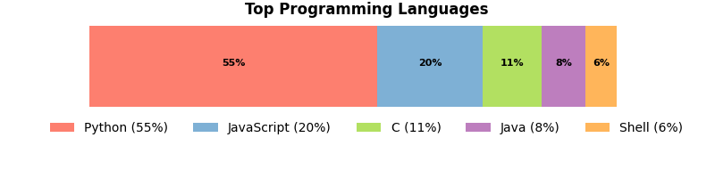

<h1 align="center">Hi 👋 I'm Thomas</h1>
<h3 align="center">A passionate security researcher/engineer and a major geek from New Zealand</h3>

:penguin: For a brief intro, have a look at my [personal website](https://www.thomaslaurenson.com)

I am currently...

- :mag: **Looking for work!**

- :seedling: Learning **more about C++ and Golang**

- :telescope: Working on [The Gray Dot](https://github.com/thegraydot) projects

:email: Reach me via [email](thomas@thomaslaurenson.com)

:link: Connect with me on [LinkedIn](https://www.linkedin.com/in/thomaslaurenson/)

<picture>
<source media="(prefers-color-scheme: dark)" srcset="data/top_languages_dark.png">

</picture>

    
    

