<h1 align="center">Hi 👋 I'm Thomas</h1>
<h3 align="center">A passionate security researcher/engineer and a major geek from New Zealand</h3>

:penguin: Brief intro on my [personal website](https://www.thomaslaurenson.com)

:email: Reach me via [email](thomas@thomaslaurenson.com)

:link: Connect with me on [LinkedIn](https://www.linkedin.com/in/thomaslaurenson/)

:telescope: See my hobby projects on [The Gray Dot](https://github.com/thegraydot)

:construction: I am currently...

- :seedling: Focussing on improving my **C++** skills

- :video_game: Developing tools for **WoW Vanilla, TBC and WoTLK**

- :boom: Writing **comic book-releated software**

  <picture>
    <source media="(prefers-color-scheme: dark)" srcset="cards/github_stats_card_dark.svg">
    
  </picture>

  <picture>
    <source media="(prefers-color-scheme: dark)" srcset="cards/github_streak_card_dark.svg">
    
  </picture>

  <picture>
    <source media="(prefers-color-scheme: dark)" srcset="cards/github_languages_card_dark.svg">
    
  </picture>

  
  

