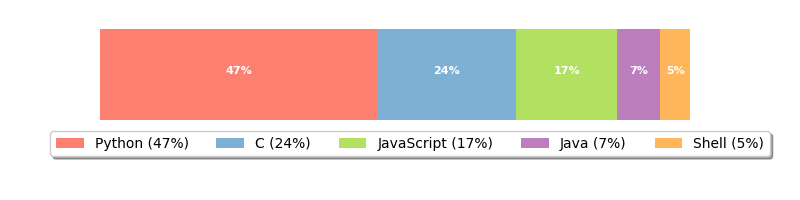

<h1 align="center">Hi 👋, I'm Thomas</h1>
<h3 align="center">A passionate security person, engineer, consultant, pentester and major geek from New Zealand</h3>

- :mag: **I'm currently looking for a job!**

- :telescope: I’m currently working on [The Gray Dot](https://github.com/thegraydot)

- :seedling: I’m currently learning **more about C++**

- :file_folder: Some of my projects are on my [personal website portfolio](https://www.thomaslaurenson.com/#portfolio)

- :page_facing_up: I regularly write articles on [The Gray Dot](https://thegraydot.io/blog) blog

- :email: Reach me on thomas@thomaslaurenson.com

- :link: Connect with me on [LinkedIn](https://www.linkedin.com/in/thomaslaurenson/)

  

  

