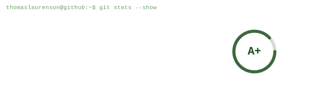

<h1 align="center">Hi 👋 I'm Thomas</h1>
<h3 align="center">A passionate security researcher/engineer and a major geek from New Zealand</h3>

<!-- Badge Row 1: website + email -->

  <a href="https://www.thomaslaurenson.com">
    <picture>
      <source media="(prefers-color-scheme: dark)" srcset="badges/badge_website_dark.svg">
      
    </picture>
  </a>
  &nbsp;
  <a href="mailto:thomas@thomaslaurenson.com">
    <picture>
      <source media="(prefers-color-scheme: dark)" srcset="badges/badge_email_dark.svg">
      
    </picture>
  </a>

<!-- Badge Row 2: github personal + github thegraydot -->

  <a href="https://github.com/thomaslaurenson">
    <picture>
      <source media="(prefers-color-scheme: dark)" srcset="badges/badge_github_personal_dark.svg">
      
    </picture>
  </a>
  &nbsp;
  <a href="https://github.com/thegraydot">
    <picture>
      <source media="(prefers-color-scheme: dark)" srcset="badges/badge_github_thegraydot_dark.svg">
      
    </picture>
  </a>

<!-- Badge Row 3: linkedin + work -->

  <a href="https://www.linkedin.com/in/thomaslaurenson/">
    <picture>
      <source media="(prefers-color-scheme: dark)" srcset="badges/badge_linkedin_dark.svg">
      
    </picture>
  </a>
  &nbsp;
  <a href="https://www.auckland.ac.nz">
    <picture>
      <source media="(prefers-color-scheme: dark)" srcset="badges/badge_work_dark.svg">
      
    </picture>
  </a>

<!-- Profile views counter (dynamic — external service) -->
<!-- 

  

 -->

  <picture>
    <source media="(prefers-color-scheme: dark)" srcset="cards/github_stats_card_dark.svg">
    
  </picture>

  <picture>
    <source media="(prefers-color-scheme: dark)" srcset="cards/github_streak_card_dark.svg">
    
  </picture>

  <picture>
    <source media="(prefers-color-scheme: dark)" srcset="cards/github_plan_card_dark.svg">
    
  </picture>

  <picture>
    <source media="(prefers-color-scheme: dark)" srcset="cards/github_activity_card_dark.svg">
    
  </picture>

